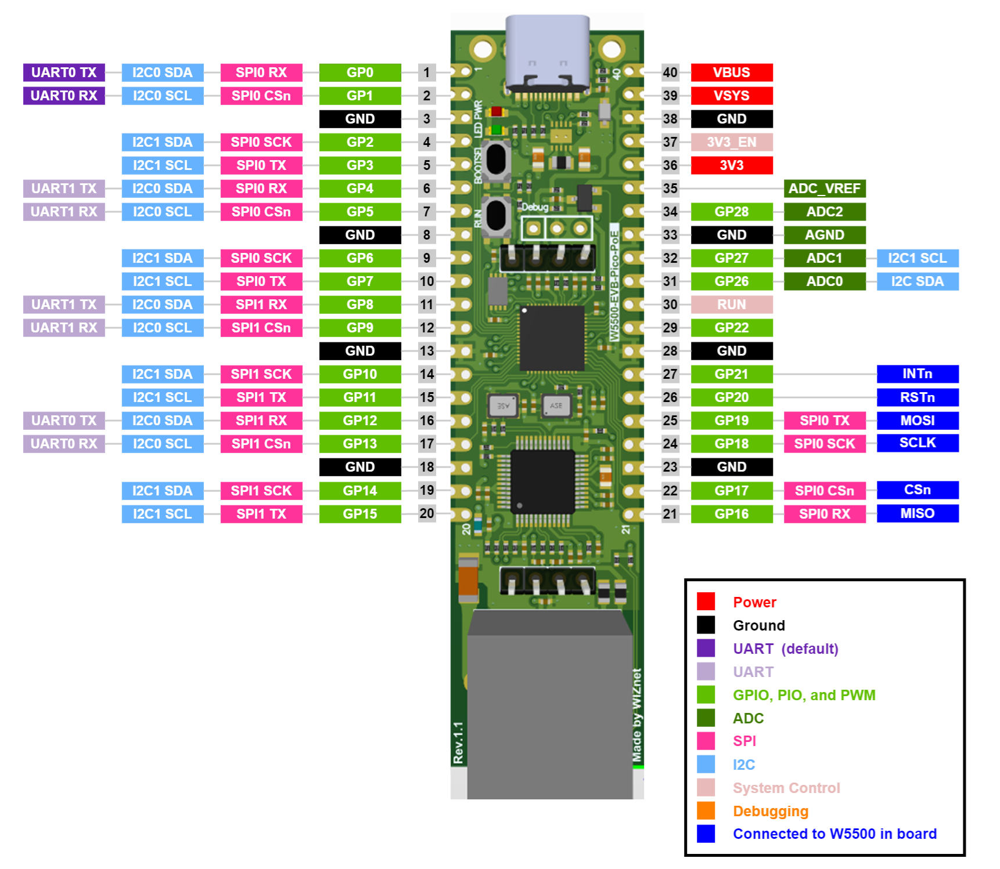

# Modbus TCP IO Module

A flexible Ethernet-based Modbus TCP IO module built on the Wiznet W5500-EVB-Pico board (RP2040). Features a modern web interface for configuration and real-time monitoring.

## Features

### Network Configuration
- DHCP support with fallback to static IP
- Configurable network settings via web interface
- Custom hostname support
- Real-time IP address display

### IO Capabilities
- **Digital Inputs**: 8 channels (GP0-GP7)
- **Digital Outputs**: 8 channels (GP8-GP15)
- **Analog Inputs**: 3 channels (GP26-GP28)
  - 12-bit resolution (0-4095)
  - 3.3V reference voltage
  - Values displayed in millivolts (0-3300mV)

### Modbus Server
- Protocol: Modbus TCP
- Default Port: 502
- Register Map:
  - 16 Discrete Inputs (Digital Inputs)
  - 16 Coils (Digital Outputs)
  - 16 Input Registers (Analog Inputs)
  - 16 Holding Registers

### Web Interface
- Modern, responsive design
- Live IO status updates
- Configuration management
  - Network settings
  - DHCP toggle with sliding switch
  - Hostname configuration
- Status indicators
  - Current IP address
  - Hostname
  - Modbus client connection status

## Hardware

### Board
- **Module**: Waveshare W5500-EVB-Pico
- **Processor**: RP2040 (Dual-core ARM Cortex-M0+)
- **Ethernet**: W5500 with lwIP stack
- **Power**: USB or PoE (requires PoE module)

### Pinout

#### Digital IO
- **Digital Inputs** (Active High):
  - DI1: GP0
  - DI2: GP1
  - DI3: GP2
  - DI4: GP3
  - DI5: GP4
  - DI6: GP5
  - DI7: GP6
  - DI8: GP7

- **Digital Outputs**:
  - DO1: GP8
  - DO2: GP9
  - DO3: GP10
  - DO4: GP11
  - DO5: GP12
  - DO6: GP13
  - DO7: GP14
  - DO8: GP15

#### Analog Inputs
- AI1: GP26 (ADC0)
- AI2: GP27 (ADC1)
- AI3: GP28 (ADC2)

#### Ethernet Interface
- CS: GP17
- IRQ: GP21
- SCK: GP18
- MOSI: GP19
- MISO: GP16

## Development

### Environment
- PlatformIO
- Framework: Arduino
- Board: Raspberry Pi Pico
- Core: Earlephilhower's Arduino core

### Dependencies
- Arduino Framework
- W5500lwIP Ethernet Library
- ArduinoModbus
- ArduinoJson
- EEPROM

### Building and Flashing
1. Clone the repository
2. Open in PlatformIO
3. Build and upload to the board

## Configuration

### Default Network Settings
- DHCP: Enabled
- Fallback Static IP: 192.168.1.200
- Subnet: 255.255.255.0
- Gateway: 192.168.1.1
- Modbus Port: 502

### Memory Layout
- Configuration stored in EEPROM
- Version control for config structure
- Automatic migration of settings

## Usage

1. Power up the board via USB or PoE
2. Connect to network via Ethernet
3. Access web interface via IP address
4. Configure network settings if needed
5. Connect Modbus TCP client to read/write IO

## Debugging
- Serial debug output (115200 baud)
- Web interface status indicators
- Modbus client connection monitoring
